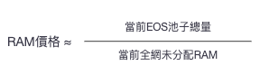
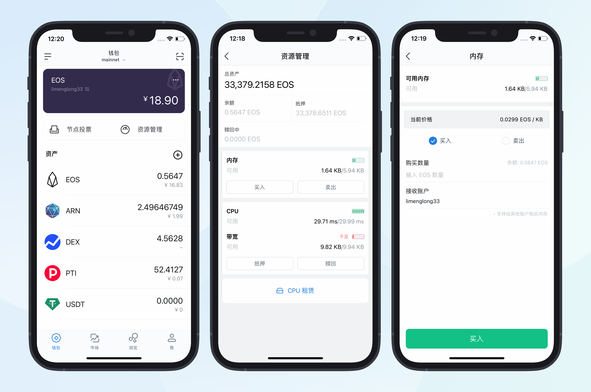

# RAM

## 介绍

### 基本概念

#### RAM

RAM 即我们平时说的内存，在 EOS 中 RAM 的含义稍微复杂一点，可以延伸为 EOS 系统中除了 CPU 和 NET 之外的所有资源，对应到传统计算机系统上，大致相当于 RAM 和数据库两者的集合。
它不是一种代币或通证，它就是 EOS 的内存资源而已。它在 EOS 软件平台上对应的就是内存数据库资源。作为 DAPP 开发者，RAM 是一项宝贵资源，数据库记录需要消耗 RAM。为了保持超级节点的高效运行，节点、RAM、内存总量有上限（以后会扩容），如果要保持区块链数据可以随时存储、修改，就需要这部分数据存储在内存中，而内存的使用需要用户自己去 EOS 系统中购买，不需要的时候再卖给系统，换回 EOS 代币。而随着 RAM 不断地被租用，剩余可用的 RAM 越来越少时，RAM 所需要抵押的 EOS 就会越来越多，也就是说 RAM 的价格会越来越贵。

#### BRAM

bRAM 是 Defibox 發行的 RAM 代币，該代币可以任意轉移、交易以及參與更多 Defi 玩法。

#### RAMS

RAM 的铭文

## RAM 的价格

RAM 的交易使用 Bancor 流動性算法，非傳統掛單賣單的方式，它的價值由系統算出，隨
著 RAM 的餘量減小而上漲。
具體算法如下：

nKB 的 RAM 的價格：

可以通过[https://dapp.newdex.io/resources/kline/ram-eos](https://dapp.newdex.io/resources/kline/ram-eos)查看最新的价格。

<iframe id="iframe" height=750 width=100% frameborder=0 allowfullscreen="true" src="https://dapp.newdex.io/resources/kline/ram-eos">  
</iframe>

根据算法可以推算出 EOS 池子跟价格的关系，如下：

## 购买 RAM

### 主网钱包

#### TP 钱包

如果你是 ios 用户，请使用其他钱包，TP 钱包最新版未支持 EOS 主网。

如果你是 android 用户。

#### imToken 钱包

打开 EOS 钱包，点击「资源管理」，进入 EOS 钱包的资源管理界面。 此时可以看到当前 EOS 账户下的总资产，以及内存（RAM）和带宽（NET 和 CPU）等详细信息。

<video height=700  width=100% src="57386_1704943019.mp4" controls title="Title"></video>

注意：遇到 CPU 不足的情况可以使用「CPU 租赁」功能购买临时的 CPU。

#### PayCash

<video height=700  width=100% src="57387_1704943033.mp4" controls title="Title"></video>

### EVM 钱包

#### NOAH诺亚

通过[NOAH 诺亚](https://noahark.io/quotation/)购买RAM的代币BRAM

### 交易所

[big.one 交易所](https://big.one/cn/trade/BRAM-EOS)

## 其他

[RAM Telegram](https://t.me/rambroclub) : https://t.me/rambroclub
