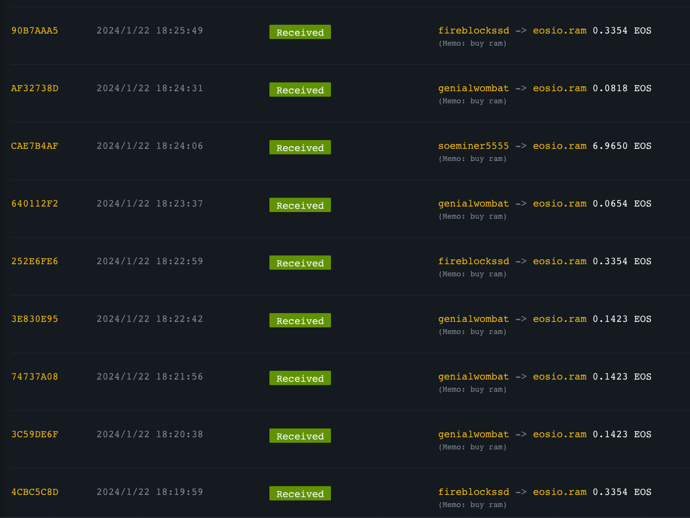
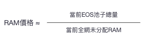
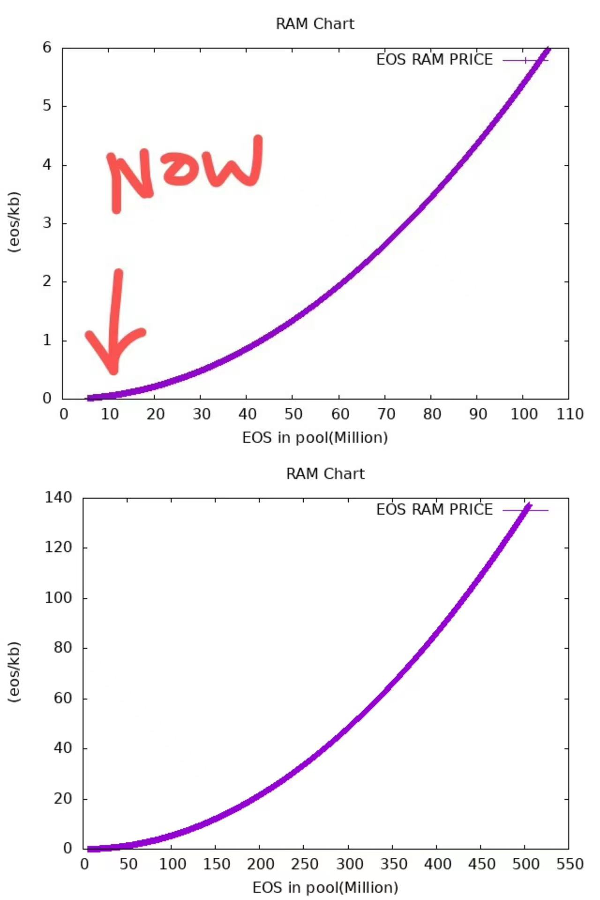
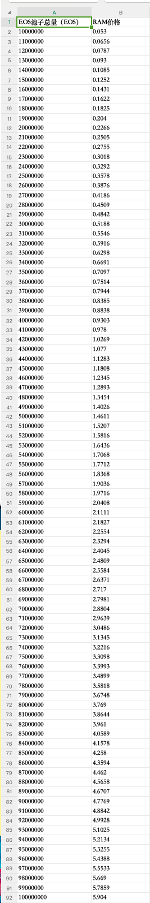

# RAM

## 介绍

### RAM 是什么？

EOS RAM 是 EOS 网络中用于存储数据的关键资源，是支撑 EOS 网络高效运行的基础设施。不同于传统的中心化存储方式，EOS RAM 以其去中心化的特性，为数据的安全与可信提供了坚实的保障。

作为 DAPP 开发者，RAM 是一项宝贵资源，如果要保持区块链数据可以随时存储、修改，就需要这部分数据存储在内存中，而内存的使用需要用户自己去 EOS 系统中购买，不需要的时候再卖给系统，换回 EOS 代币。

随着 RAM 不断地被租用，剩余可用的 RAM 越来越少时，RAM 所需要抵押的 EOS 就会越来越多，也就是说 RAM 的价格会越来越贵。

EOS 上干什么都要消耗 RAM（ 注册账户，生态应用等），下图就是 EOS 的 DAPP 消耗 RAM。

#### BRAM

bRAM 是 Defibox 發行的 RAM 代币，該代币可以任意轉移、交易以及參與更多 Defi 玩法。

#### RAMS

RAM 的铭文，会赋予 EOS BTC L2 上的更多作用。

EOS 基金会 CEO Yves 私人账号和 EOS Labs 强哥的账号都在前 10

<iframe id="iframe" height=750 width=400 frameborder=0 allowfullscreen="true" src="https://www.eosram.info/">  
</iframe>

## RAM 的价格

RAM 的交易使用 Bancor 流動性算法，非傳統掛單賣單的方式，它的價值由系統算出，隨
著 RAM 的餘量減小而上漲。
具體算法如下：

nKB 的 RAM 的價格：

例如 EOS 上的 Upland、EVM 每日都要消耗 RAM。当 RAM 不够的时候，就需要去购买。

可以通过[https://dapp.newdex.io/resources/kline/ram-eos](https://dapp.newdex.io/resources/kline/ram-eos)查看最新的价格。

<iframe id="iframe" height=750 width=100% frameborder=0 allowfullscreen="true" src="https://dapp.newdex.io/resources/kline/ram-eos">  
</iframe>

根据算法可以推算出 EOS 池子跟价格的关系，如下：

## 购买 RAM

<iframe width="560" height="315" src="https://www.youtube.com/embed/1hM-DB15P8I?si=X4UO5uPz3QKxLxzN" title="YouTube video player" frameborder="0" allow="accelerometer; autoplay; clipboard-write; encrypted-media; gyroscope; picture-in-picture; web-share" allowfullscreen></iframe>

## Mint RAMS

[Mint RAMS 地址](https://ramseos.netlify.app/https://ramseos.netlify.app/) : https://ramseos.netlify.app/https://ramseos.netlify.app/

## Telegram 社区

[RAM Telegram](https://t.me/rambroclub) : https://t.me/rambroclub
