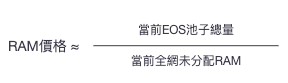

# RAM

## 介绍

### 基本概念

#### RAM

EOS，这个被誉为区块链 3.0 的强大平台，以其独特的架构和功能吸引了全球的关注。而在 EOS 的众多特性中，RAM 作为其核心资源之一，更是引领了区块链存储的新篇章。
EOS RAM，如同其名，是 EOS 网络中用于存储数据的关键资源。在 EOS 中，RAM 不仅用于存储数据，更是支撑 EOS 网络高效运行的基础设施。不同于传统的中心化存储方式，EOS RAM 以其去中心化的特性，为数据的安全与可信提供了坚实的保障。
让我们深入了解一下 EOS RAM 的独特之处。首先，EOS RAM 的去中心化特性意味着数据的存储不再依赖于某个中心化的机构或服务器。这意味着数据的所有权和控制权回归到了用户手中，大大提高了数据的安全性和隐私性。
其次，EOS RAM 的另一个重要特性是其可扩展性。随着区块链技术的发展，数据存储的需求也在不断增长。EOS RAM 的设计满足了这种需求，允许用户根据需要扩展其存储空间，从而确保了 EOS 网络的高效运行。
此外，EOS RAM 的灵活性也是其一大亮点。用户可以根据自己的需求购买或出售 RAM。这一市场化的运作方式，既保证了资源的有效配置，又为投资者提供了新的投资机会。

作为 DAPP 开发者，RAM 是一项宝贵资源，如果要保持区块链数据可以随时存储、修改，就需要这部分数据存储在内存中，而内存的使用需要用户自己去 EOS 系统中购买，不需要的时候再卖给系统，换回 EOS 代币。

随着 RAM 不断地被租用，剩余可用的 RAM 越来越少时，RAM 所需要抵押的 EOS 就会越来越多，也就是说 RAM 的价格会越来越贵。

#### BRAM

bRAM 是 Defibox 發行的 RAM 代币，該代币可以任意轉移、交易以及參與更多 Defi 玩法。

#### RAMS

RAM 的铭文，目前更多是信仰，共识，没有太多介绍。
RAMS 目前榜一是 EOS 基金会 CEOYves 的私人账号，屁股决定位置。

## RAM 的价格

RAM 的交易使用 Bancor 流動性算法，非傳統掛單賣單的方式，它的價值由系統算出，隨
著 RAM 的餘量減小而上漲。
具體算法如下：

nKB 的 RAM 的價格：

例如 EOS 上的 Upland、EVM 每日都要消耗 RAM。当 RAM 不够的时候，就需要去购买。

可以通过[https://dapp.newdex.io/resources/kline/ram-eos](https://dapp.newdex.io/resources/kline/ram-eos)查看最新的价格。

<iframe id="iframe" height=750 width=100% frameborder=0 allowfullscreen="true" src="https://dapp.newdex.io/resources/kline/ram-eos">  
</iframe>

根据算法可以推算出 EOS 池子跟价格的关系，如下：

## 购买 BRAM

## 其他

[RAM Telegram](https://t.me/rambroclub) : https://t.me/rambroclub

### 从交易所提币到 EVM

### EVM 提币到交易所

通过 Noah
